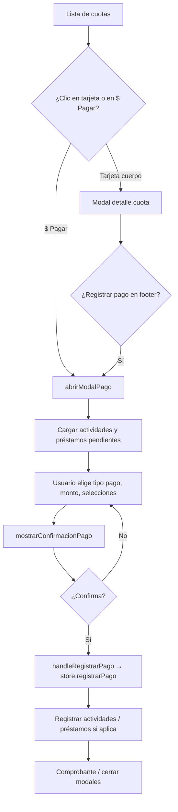
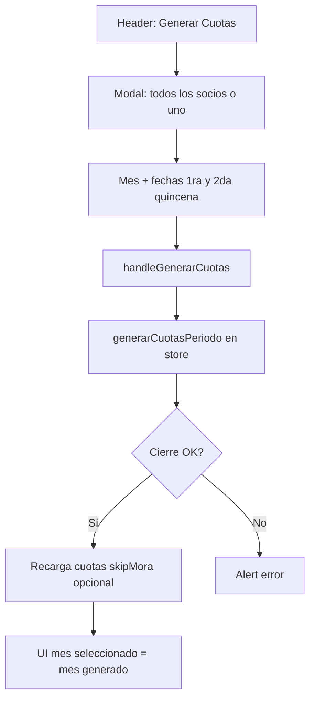
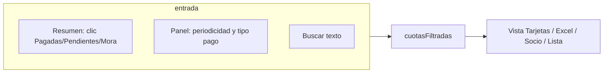

# 14 — Layout visual, tarjetas y flujos de interacción

Este documento complementa la documentación funcional con **dónde** aparece cada cosa en `Cuotas.vue`, **qué ve el usuario** en tarjetas y **cómo** fluyen las acciones principales (pagar, generar, filtrar).

---

## 1. Mapa general de la pantalla (desktop)

De arriba hacia abajo, el contenido principal queda así:

```text
┌─────────────────────────────────────────────────────────────────┐
│  LoadingScreen (solo mientras inicializando)                     │
├─────────────────────────────────────────────────────────────────┤
│  [Breadcrumbs]                                                    │
│  ┌─────────────────────────────────────────────────────────────┐│
│  │ [← Volver]  [Icono $]  Cuotas y Pagos                        ││
│  │            Subtítulo + badge MES (emoji + nombre + año)       ││
│  │                              [+ Generar Cuotas] [🗑 Borrar]*   ││
│  └─────────────────────────────────────────────────────────────┘│
│  * Botones solo si no es visor y (admin email / hay pendientes)  │
├─────────────────────────────────────────────────────────────────┤
│  RESUMEN (grid 3–5 columnas en md+)                               │
│  ┌─────────┐ ┌─────────┐ ┌─────────┐ ┌──────────────┐ ┌────────┐ │
│  │ Pagadas │ │Pendiente│ │ En Mora │ │Total Recaud. │ │ % Prog.│ │
│  │ (click  │ │ (click  │ │ (click  │ │ (click móvil │ │ círculo│ │
│  │ filtra) │ │ filtra) │ │ filtra) │ │ → modal)*    │ │        │ │
│  └─────────┘ └─────────┘ └─────────┘ └──────────────┘ └────────┘ │
│  * En desktop el total recaudado es tarjeta estática; en móvil   │
│    abre modal de desglose efectivo vs transferencia               │
├─────────────────────────────────────────────────────────────────┤
│  [Mostrar/Ocultar Filtros]  [Quitar filtros]   “Filtros activos” │
│  Panel colapsable: Periodicidad (Todos / Mensual / Quincenal)     │
│                    Forma de pago (Todos / Efectivo / Transf.)     │
├─────────────────────────────────────────────────────────────────┤
│  🔍 [ Buscar por nombre, descripción, documento, teléfono… ]       │
├─────────────────────────────────────────────────────────────────┤
│  Selector de VISTA (solo cuando hay cuotas):                      │
│  [ Tarjetas | Excel | Por Socio | Lista ]                         │
├─────────────────────────────────────────────────────────────────┤
│  LISTADO DE CUOTAS (según vista elegida)                          │
│  … o estados vacíos / carga …                                     │
└─────────────────────────────────────────────────────────────────┘
```

**Móvil:** el header se simplifica; el periodo se elige con botón que abre `modalSelectorMes`. El resumen va en grid 2×2 + barra de progreso.

---

## 2. Selector de vista (cuatro modos)

| Botón | Variable | Qué muestra |
|--------|----------|----------------|
| **Tarjetas** | `!vistaExcel && !vistaAgrupada && !vistaLista` | Una **tarjeta por cuota** (layout tipo card con acciones). |
| **Excel** | `vistaExcel` | Tabla densa estilo hoja; **se desactiva en viewport &lt; md**. |
| **Por Socio** | `vistaAgrupada` | **Un bloque por socio** (cabecera + lista de cuotas internas). |
| **Lista** | `vistaLista` | Filas compactas con expansión en móvil. |

---

## 3. Vista “Por Socio”: qué va en la cabecera del grupo

Cada grupo (`cuotasAgrupadasPorSocio`) muestra un **header** con:

| Elemento | Origen / significado |
|----------|----------------------|
| **Avatar** | Generado con nombre + `avatar_seed` / `avatar_style` del socio. |
| **Nombre** | `socio.nombre` |
| **“N cuotas”** | Cantidad de cuotas del socio en el listado filtrado. |
| **Total** | Suma de `valor_cuota` de esas cuotas. |
| **Pagado** | `getTotalPagadoConActividadesSocio` por cuota, acumulado (cuota + sanción abonada + actividades + préstamos en ese contexto). |
| **Pendiente** | Suma de `getTotalAPagar(cuota)` solo si `estadoReal !== 'programada'` (incluye sanción en el pendiente). |
| **Actividades (texto morado)** | Solo si `actividadesPendientes > 0`: etiqueta + monto pendiente de actividades. |
| **Abonado préstamos (cielo)** | Si hay abonos a plan en el periodo. |
| **Pendiente préstamos (azul)** | Total cuotas de préstamo pendientes del periodo. |
| **Total a Pagar (rojo si &gt; 0)** | `pendiente + actividadesPendientes + cuotasPrestamosPendientes` del grupo. |

Debajo, **cada cuota** del socio es una sub-tarjeta (misma lógica visual que la vista por tarjetas individuales, sección 4).

---

## 4. Tarjeta de una cuota (vista Tarjetas o lista dentro de “Por Socio”)

### 4.1 Color de fondo y borde (mensaje visual)

| Condición | Apariencia |
|-----------|------------|
| `estadoReal === 'pagada'` | Fondo verde claro, borde verde. |
| `estadoReal === 'mora'` | Fondo rosa/rojo claro, borde rojo. |
| `estadoReal === 'programada'` | Fondo gris pizarra, borde gris. |
| `tienePagoParcialCuota` | Fondo ámbar, borde ámbar + badge **“PAGO PARCIAL”** arriba a la derecha. |
| Resto (pendiente típico) | Fondo ámbar/naranja suave. |

### 4.2 Badges y esquinas

- **AJUSTE** (azul, esquina superior izquierda): si `tieneAjuste(cuota)` — indica cambios históricos de valor.
- **1er / 2da Quincena** (violeta): si `quincena === 1` o `2`.
- **Estado** (pill): Pagada / En Mora / Programada / Pago Parcial / Pendiente según `estadoReal` y pago parcial.
- **No calcular multa** (checkbox): solo si `esUsuarioAdmin` (email admin fijo en código); no propagar el clic al abrir detalle.

### 4.3 Contenido central (texto)

- Emoji del mes + **“Mes Año”**.
- **Vence:** `fecha_vencimiento` o `fecha_limite` formateada.

### 4.4 Columna de importes (derecha o debajo según breakpoint)

**Si hay pago parcial:**

- Título **“Valor Pendiente”** → `getTotalAPagarConActividadesSocio` (lo que falta pagar en total).
- **Pagado:** `getTotalPagadoConActividadesSocio`.
- Desglose en verde: Cuota, Multa, actividades, abonado préstamos (si aplica).

**Si está pagada:**

- **Total pagado** + desglose (cuota al valor cuota, multa, actividades, préstamos).

**Si pendiente / mora / programada (sin parcial):**

- **Total a Pagar** (destacado; rojo si mora, naranja si hay actividades o préstamos pendientes).
- Líneas: Cuota base, Sanción pendiente, actividades, préstamos pendientes, abonado préstamos.
- Línea **Pagado:** total abonado hasta el momento.

### 4.5 Botones de acción (desktop `sm+`)

| Situación | Botones |
|-----------|---------|
| Pago parcial | **$ Pagar** (ancho completo), fila **Editar** + **Reenviar**. |
| No pagada | **$ Pagar** (si no visor). |
| Pagada | **Editar**, **Reenviar** comprobante. |

En **móvil** hay variantes en plantilla paralela (filas `v-for` alternativos más abajo en el archivo) para el mismo flujo.

**Clic en la tarjeta** (zona principal): abre **`abrirModalDetalleCuota`** (detalle + historial). Los botones usan `@click.stop` para no disparar el detalle.

---

## 5. Modal “Registrar pago” — estructura visual

Flujo: **`abrirModalPago(cuota)`** → puede mostrar `preparandoModalPago` brevemente → modal principal.

Dentro del scroll del modal (orden típico):

```text
┌──────────────────────────────────────────┐
│ Header: “Registrar Pago” + subtítulo       │
├──────────────────────────────────────────┤
│ Card socio: avatar, nombre, descripción  │
│ [Alerta “ajustes de valor” si aplica]      │
│                                           │
│ Si NO es pago parcial:                   │
│   filas Cuota, Sanción, Actividades*,     │
│   Préstamos*, → Total a pagar            │
│ Si ES pago parcial:                      │
│   Total a pagar, sanción pendiente,      │
│   Pagado anteriormente, Total pendiente  │
├──────────────────────────────────────────┤
│ Tipo de pago: [ Efectivo ] [ Transferencia ] │
│ (Transferencia: checkbox 4×1000 GMF)      │
├──────────────────────────────────────────┤
│ Actividades pendientes (lista seleccionable) │
├──────────────────────────────────────────┤
│ Cuotas de préstamo pendientes (lista)    │
├──────────────────────────────────────────┤
│ Campo VALOR ($) + ayuda tope según tipo  │
├──────────────────────────────────────────┤
│ [ Registrar Pago ] → abre confirmación   │
└──────────────────────────────────────────┘
```

- **Confirmación:** modal aparte con desglose (sanción → actividades → préstamos → cuota) y GMF si transferencia.
- Tras confirmar: **LoadingBox** “Registrando pago” y luego comprobante / cierre.

---

## 6. Diagrama: flujo “Registrar pago”



---

## 7. Diagrama: flujo “Generar cuotas”



---

## 8. Diagrama: filtros y búsqueda



---

## 9. Estados de pantalla sin datos

| Condición | Qué ve el usuario |
|-----------|-------------------|
| `loading || inicializando` | Spinner + “Cargando cuotas…” o “Preparando cuotas del mes…” si `generandoCuotas`. |
| `cuotasMesActual.length === 0` | Ilustración + “No hay cuotas para [mes]” + botón **Generar cuotas** (si no visor y admin). |
| `cuotasFiltradas.length === 0` pero hay cuotas | Mensaje naranja: ningún resultado con filtros actuales. |

---

## 10. Modal detalle de cuota (al hacer clic en la tarjeta)

- Resumen de la cuota, totales, desglose sanción/actividades.
- **Historial de pagos** (filas con valor, forma de pago, botón Ver si hay código).
- Footer: **Cerrar**, **Registrar Pago** (si no pagada), **Reenviar comprobante** (si pagada o pago parcial según condición del template).

---

## 11. Valores seleccionados por defecto

### 11.1 Al entrar a la pantalla (tras `cargarNatillera` + carga de cuotas)

| Variable / control | Valor por defecto | Notas |
|-------------------|-------------------|--------|
| `mesSeleccionado` | `route.params.mes` si existe; si no, **mes actual** si está dentro de `mes_inicio`–`mes_fin`; si no, **primer mes** del rango (`mesesNatillera[0]`). | Define qué mes se muestra. |
| `filtroEstado` | `'todos'` | Sin filtrar por pagada/pendiente/mora. |
| `filtroPeriodicidad` | `'todos'` | Sin filtrar mensual/quincenal. |
| `filtroTipoPago` | `'todos'` | Sin filtrar efectivo/transferencia. |
| `busquedaCuotas` | `''` | Búsqueda vacía. |
| `mostrarFiltros` | `false` | Panel de filtros **cerrado** hasta que el usuario pulse “Mostrar filtros”. |
| `vistaExcel` | `false` | Vista **Tarjetas** (no Excel). |
| `vistaAgrupada` | `false` | No agrupada por socio. |
| `vistaLista` | `false` | No vista lista compacta. |
| `diasGracia` | `3` hasta cargar natillera; luego `reglas_multas.dias_gracia` o 3. | |
| `formCuotas.mes` | Se iguala a `mesSeleccionado` al terminar de cargar natillera. | Para el modal generar. |
| `formCuotas.fecha_quincena1/2` | `''` hasta abrir modal o `cargarFechasDelMes`. | |

### 11.2 Al cambiar el mes seleccionado (usuario o navegación)

El `watch` de `mesSeleccionado` (cuando **no** está en inicialización):

- Pone `formCuotas.mes = nuevoMes`.
- Resetea **`filtroPeriodicidad`** y **`filtroTipoPago`** a **`'todos'`**.
- **No** resetea `filtroEstado` ni la búsqueda (el usuario puede seguir filtrando por estado/texto).
- Puede disparar **`generarCuotasFaltantes`** si detecta cuotas incompletas para ese mes/año.

### 11.3 Al abrir **Registrar pago** (`abrirModalPago`)

| Control | Valor inicial |
|---------|----------------|
| `formPago.valor` | Primero `getTotalAPagar(cuota)` (cuota + sanción pendiente − abonado a cuota). Tras cargar actividades/préstamos y las selecciones automáticas, **`actualizarValorPagoConActividades`** / **`actualizarValorPagoConCuotasPrestamos`** ajustan el campo al total coherente con obligaciones. |
| `formPago.tipo_pago` | **`'efectivo'`** |
| `formPago.aplicaImpuesto4x1000` | **`false`** |
| `actividadesSeleccionadas` | Se **vacía** y luego, si `cargarActividadesPendientes` encuentra coincidencias de periodo, se **añaden todas** las actividades del periodo de la cuota (`actividadesCoincidentes`). Esas quedan en `actividadesDeLaCuotaActual` → **no se pueden desmarcar**. |
| `cuotasPrestamosSeleccionadas` | Tras `cargarCuotasPrestamosPendientes`: se **seleccionan automáticamente** todas las cuotas del plan con `esta_programada === true` (mismo mes/año/quincena que la cuota de natillera). |
| Desplegables | Actividades y préstamos: **cerrados** (`actividadesDesplegableAbierto`, `cuotasPrestamosDesplegableAbierto` = false). |
| `desplegableYaAbonadoOpen` | `true` si hay pago parcial (`tienePagoParcialCuota`). |

Después de cargar actividades/préstamos, si hubo selección automática, se llama **`actualizarValorPagoConActividades`** / **`actualizarValorPagoConCuotasPrestamos`** para que el **valor del campo** refleje el total coherente (tope según tipo efectivo/transferencia).

### 11.4 Al abrir **Generar cuotas** (`abrirModalGenerarCuotas`)

| Campo | Valor |
|-------|--------|
| `formCuotas.tipoGeneracion` | **`'todos'`** |
| `formCuotas.socioSeleccionado` | **`null`** |
| `busquedaSocioCuotas` | **`''`** |
| Mes del formulario | Alineado con `formCuotas.mes` / mes del selector; fechas vía `cargarFechasDelMes`. |

### 11.5 Modal **Exportar a Excel**

- **`columnasSeleccionadas`:** por defecto **todas** las claves de `columnasDisponibles` (12 columnas).
- Si el usuario desmarca todas y abre de nuevo, al exportar se vuelven a seleccionar todas.

### 11.6 **Quitar filtros** (`quitarFiltros`)

- `filtroEstado`, `filtroPeriodicidad`, `filtroTipoPago` → **`'todos'`**; `busquedaCuotas` → **`''`**; `mostrarFiltros` → **`false`**.

---

## 12. Orden de organización

### 12.1 Orden vertical de la página (de arriba abajo)

1. Pantalla de carga global (`LoadingScreen` / bloque spinner) si aplica.  
2. Contenedor principal (`max-w-7xl`).  
3. Header (breadcrumbs, título, periodo, acciones).  
4. Resumen en tarjetas en este orden horizontal: **Pagadas → Pendientes → En Mora → Total recaudado → % progreso**.  
5. Barra de filtros (toggle + quitar) en **desktop**; en **móvil**, bloque compacto de filtros **antes** de la búsqueda.  
6. Campo de **búsqueda** (visible debajo del bloque de filtros en el flujo principal).  
7. Selector de **vista** (Tarjetas / Excel / Por Socio / Lista) cuando hay cuotas.  
8. Listado o estados vacíos.  
9. Botón flotante “Volver arriba” si hay scroll.

### 12.2 Orden de las cuotas en la lista (`cuotasFiltradas`)

1. **Prioridad de estado** (número menor = más arriba): **mora (1)** → **pendiente (2)** → **programada (3)** → **pagada (4)**.  
2. A igualdad de prioridad: **orden alfabético** del nombre del socio (`localeCompare` `es`).

### 12.3 Orden en vista **Por Socio**

- **Grupos:** orden alfabético por **nombre del socio**.  
- **Dentro de cada grupo:** cuotas ordenadas por **quincena** (1ª antes que 2ª); si ambas son mensuales, orden estable del array.

### 12.4 Orden dentro de la **tarjeta de cuota** (bloque de información)

En el template típico (lectura visual):

1. **Esquinas:** badge **PAGO PARCIAL** (superior derecha), **AJUSTE** (superior izquierda) si aplica.  
2. **Bloque principal izquierdo:** emoji del mes + título **Mes Año** + línea **Vence:** (fecha).  
3. **Badges en fila:** etiqueta de **quincena** (si aplica) → **estado** (Pagada / En Mora / …) → checkbox **No calcular multa** (solo admin).  
4. **Bloque importes** (a la derecha o debajo en móvil): etiqueta de contexto (**Valor pendiente** / **Total a pagar** / **Total pagado**) → cifra principal → **desglose** en este orden fijo: **Cuota** → **Multa** → **Actividades** → **Préstamos** → línea **Pagado** total si aplica.  
5. **Acciones** al pie o lateral: **Pagar** / **Editar** / **Reenviar** según estado y rol.

### 12.5 Orden dentro del modal **Registrar pago** (scroll)

1. Cabecera del modal (título + subtítulo según pago parcial o no).  
2. Tarjeta **socio** (avatar, nombre, alerta de ajustes si hay).  
3. Resumen de montos: filas **Cuota → Sanción → Actividades (si seleccionadas) → Préstamos (si seleccionados) → Total a pagar**; o bloque alternativo de pago parcial (total / pagado / pendiente).  
4. **Tipo de pago** (Efectivo | Transferencia) y, si transferencia, opción **4×1000**.  
5. Sección **actividades** (lista / desplegable).  
6. Sección **cuotas de préstamo** (lista / desplegable).  
7. Campo **valor** a consignar.  
8. Botón principal **Registrar pago** → modal de **confirmación** con desglose en orden de imputación: **sanción → actividades → préstamos → cuota** (+ GMF si aplica).

### 12.6 Orden lógico del **desglose de pago** (confirmación y backend)

Coincide con la regla de negocio: **1)** Sanción → **2)** Actividades → **3)** Préstamos → **4)** Cuota natillera; el GMF en transferencia es aparte y no reduce la obligación.

### 12.7 Exportación Excel

- Orden de **columnas** en la hoja: el mismo orden que `columnasSeleccionadas`, que por defecto sigue el orden fijo de `columnasDisponibles` (socio, descripción, periodicidad, …, quincena).  
- Orden de **filas**: igual que `cuotasFiltradas` en ese momento.

---

## 13. Referencia rápida: colores semánticos en UI

| Color / tono | Uso |
|--------------|-----|
| Verde | Pagada, montos pagados, botón Pagar principal. |
| Rojo / rosa | Mora, sanción pendiente, pendiente fuerte. |
| Ámbar / naranja | Pendiente, pago parcial, avisos. |
| Gris | Programada. |
| Violeta | Editar, quincena, acciones secundarias. |
| Morado | Actividades. |
| Azul | Préstamos pendientes / transferencia. |

Este esquema ayuda a diseñar o auditar una **réplica visual** (otro framework) manteniendo la misma jerarquía de información.
