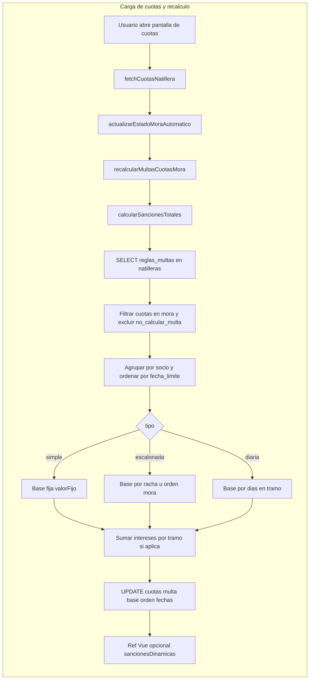
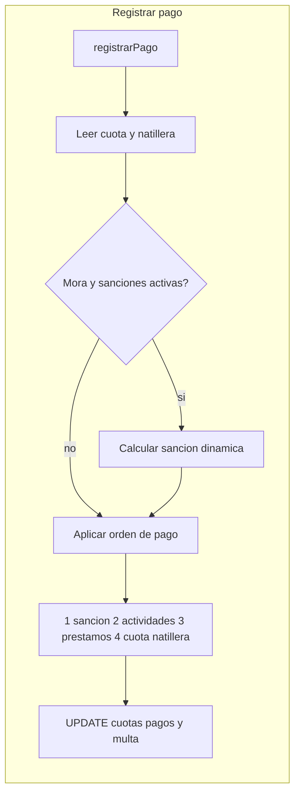

# Informe: cálculo de multas y sanciones (proceso actual)

Documento de referencia sobre cómo se calculan y persisten las multas/sanciones en Natillerapp: origen de datos, consultas, estado en memoria y puntos delicados del código.

**Relacionado:** [04-sanciones-multas-reglas-calculo.md](./04-sanciones-multas-reglas-calculo.md) (reglas de negocio).

---

## 1. Resumen ejecutivo

- **No hay motor de sanciones en PostgreSQL**: las reglas se leen de **`natilleras.reglas_multas`**, el cálculo ocurre **en el cliente** (Vue + Pinia, principalmente `src/stores/cuotas.js`), y los resultados se **persisten** actualizando filas en **`cuotas`**.
- Hay **dos capas de verdad**: valores guardados en BD (`valor_multa`, `valor_multa_base`, etc.) y, en algunas pantallas, un mapa **en memoria** (`sancionesDinamicas` / `sancionesPorCuota`) rellenado tras llamar a `calcularSancionesTotales`.
- El diseño busca que la **multa escalonada no “baje”** cuando el socio paga una cuota y queda menos mora: modelo de **“racha”** con `mora_orden` y `valor_multa_base` como **foto fija** de la base.

---

## 2. Origen de la configuración (BD vs local)

| Dato | Dónde vive | Notas |
|------|------------|--------|
| Reglas (`dias_gracia`, `sanciones.tipo`, montos, niveles, intereses adicionales) | Tabla **`natilleras`**, campo **`reglas_multas`** (JSON; a veces llega como **string** y se hace `JSON.parse` en `calcularSancionesTotales`) | Fuente principal vía Supabase al cargar la natillera. |
| Periodicidad natillera / socio | **`natilleras.periodicidad`**, **`socios_natillera.periodicidad`** | Afecta el caso “socio mensual en natillera quincenal” (p. ej. sumar dos escalones en `registrarPago`). |
| Montos por cuota | Tabla **`cuotas`**: `valor_multa`, `valor_multa_base`, `valor_multa_intereses`, `mora_orden`, `fecha_inicio_mora`, `valor_pagado_sancion`, `no_calcular_multa`, fechas, `estado` | Lo que la UI y reportes muestran tras los `update`. |
| Caché / memoria de UI | Refs Vue: p. ej. **`sancionesDinamicas`** en `Cuotas.vue`, **`sancionesPorCuota`** en `NatilleraDetalle.vue` | Se rellenan con el objeto `sanciones` que devuelve `calcularSancionesTotales`. |

---

## 3. Tipos de sanción implementados

Definidos en `reglas_multas.sanciones`:

1. **`simple`**: multa base = `valorFijo`.
2. **`escalonada`**: niveles `{ cuotas, valor }`. En el código coexisten:
   - **`calcularMulta(config, cantidadCuotasMora)`**: niveles ordenados por `cuotas` **descendente**; primer nivel con `cantidadCuotasMora >= nivel.cuotas`.
   - **`obtenerValorSancionPorPosicion(config, posicion)`**: orden **ascendente**; primer nivel con `posicion <= nivel.cuotas`; si supera todos, **último** nivel. Usado para **posición en racha** (`mora_orden` / orden por `fecha_limite`).
3. **`diaria`**: `valorPorDia * días en tramo` (desde primer día en mora de esa cuota hasta el día **anterior** al inicio de mora de la **siguiente** cuota en mora del mismo socio, o hasta hoy si es la última).

**Intereses adicionales** (config): en `calcularSancionesTotales` se calculan por **tramos** entre cuotas consecutivas en mora. El código acepta claves alternativas (p. ej. regex `/interes/i` sobre claves del objeto de sanciones).

---

## 4. Funciones clave y flujo

### 4.1 `fetchCuotasNatillera` (carga inicial)

Tras leer socios y cuotas:

1. **`actualizarEstadoMoraAutomatico`**: ajusta estados (`programada` / `pendiente` / `mora`) según fechas y pago total (`valor_cuota + valor_multa`).
2. **`recalcularMultasCuotasMora`** → delega en **`calcularSancionesTotales`**.

### 4.2 `calcularSancionesTotales(natilleraId, cuotasLista?)`

- **Consulta BD**: `natilleras` con `reglas_multas` y `periodicidad`.
- **Lista de cuotas**: `cuotasLista` si se pasa; si no, **`cuotas` del store**.
- **Filtro**: `estado === 'mora'` **o** estado real mora mediante **`calcularEstadoRealCuotaStore`** (incluye parciales en mora por fecha).
- Excluye **`no_calcular_multa`** y puede poner multas a 0 en BD para esas filas.
- Agrupa por **`socio_natillera_id`**, orden por **`fecha_limite`**.
- Persiste con varios `supabase.from('cuotas').update(...)` (en paralelo): `valor_multa`, `valor_multa_intereses`, y en primera asignación `valor_multa_base`, `mora_orden`, `fecha_inicio_mora`.
- Devuelve `{ sanciones: { [cuotaId]: total } }` para actualizar maps en la UI.

### 4.3 `actualizarEstadoMoraAutomatico` (paso a mora)

- Lee **`reglas_multas`** (si falta `natilleraId`, resuelve vía **`socios_natillera`**).
- Puede usar lista en memoria o consultar **`cuotas`** en BD (`estado = 'mora'`) si hace falta.
- Para nuevas cuotas en mora: **`ordenParaValor = min(moraOrden, 4)`** (tope de escalón 4 en ese tramo).
- Actualiza **`estado`**, **`fecha_mora`**, y según tipo: **`valor_multa`**, **`valor_multa_base`** (no en diaria), **`mora_orden`**, **`fecha_inicio_mora`**.

### 4.4 `registrarPago`

- Obtiene cuota y **`natillera_id`** por **`socios_natillera`**.
- Si la cuota está en **`mora`** y hay sanciones activas, recalcula **`sancionDinamica`** (incluye lógica quincenal/mensual para escalonada).
- **Prioridad** para el monto total de sanción a liquidar: **`valor_multa` guardado** > 0 usa ese valor; si no, la dinámica.
- **Orden de aplicación del dinero**: **1)** sanción, **2)** actividades, **3)** cuotas de préstamos (opción), **4)** cuota natillera.
- Actualiza **`valor_pagado_sancion`**, **`valor_multa`** según escenarios; reintentos si faltan columnas opcionales en BD.

### 4.5 Vistas

- **`Cuotas.vue` — `getSancionTotalCuota`**: en mora, prioriza **`sancionesDinamicas[cuota.id]`**; si no, **`valor_multa`** (o base + intereses) desde la cuota.
- **`NatilleraDetalle.vue` / `Socios.vue`**: priorizan **`valor_multa` persistido** si es > 0; luego dinámico o lógica de parcial con multa pendiente.

### 4.6 `natilleras.js` — `calcularEstadisticas`

Replica lógica de sanciones **en el cliente** (objeto local `sancionesDinamicas`) para totales pendientes en estadísticas/dashboard, además de `valor_multa` por cuota.

---

## 5. Consultas Supabase (patrones)

- **`natilleras`**: `select('reglas_multas, periodicidad')` (y variantes con más campos en otros flujos).
- **`socios_natillera`**: ids, `periodicidad`, `natillera_id`.
- **`cuotas`**: `select('*')` en cargas; `update` por `id`; filtros `estado = 'mora'`, `socio_natillera_id`, etc.

No hay **RPC** dedicado a multas en el flujo revisado: todo vía **PostgREST** desde el front.

---

## 6. Comportamientos delicados o fáciles de malinterpretar

1. **`calcularMultaDinamica`** en `cuotas.js` está **exportada** pero **no se usa** en otros archivos de `src`; el agregado real es **`calcularSancionesTotales`**. Si alguien usara `calcularMultaDinamica` para intereses en tipos no diarios, podría **discrepar** (usa lógica distinta al bucle principal).
2. **`registrarPago`** puede usar **`Math.round`** en un tramo de intereses, mientras **`calcularSancionesTotales`** usa **`Math.floor`** en el agregado: posible **diferencia de pesos** entre pantalla y pago.
3. **Tope `min(moraOrden, 4)`** en **`actualizarEstadoMoraAutomatico`** al entrar en mora; otros caminos pueden usar órdenes mayores.
4. **Tres sitios** con lógica parecida: `cuotas.js`, `Cuotas.vue`, `natilleras.js` (estadísticas) — riesgo de **desalineación** si solo se cambia uno.
5. **`no_calcular_multa`**: anula sanción en cálculo, pago y puede forzar ceros en BD en el agregado.

---

## 7. Campos de `cuotas` relevantes

| Campo | Rol |
|-------|-----|
| `valor_multa` | Total de multa (base + intereses en el modelo de agregación). |
| `valor_multa_base` | Foto de la base (no diaria); evita que baje el escalón. |
| `valor_multa_intereses` | Parte de intereses / tramos. |
| `mora_orden` | Orden dentro de la racha de mora del socio. |
| `fecha_inicio_mora` | Inicio del tramo (diaria e intereses). |
| `valor_pagado_sancion` | Abonos explícitos a la multa. |
| `no_calcular_multa` | Excluye la cuota del cálculo y de la UI de sanciones. |

---

## 8. Diagramas de flujo

**Nota:** Si el preview no dibuja Mermaid, activa soporte Mermaid en el visor (extensión en VS Code/Cursor: “Markdown Preview Mermaid Support”) o abre el archivo en GitHub. Debajo hay un **esquema ASCII** que siempre se lee bien.

### 8.1 Esquema ASCII (referencia rápida)

```
FLUJO A — Carga / recálculo (fetchCuotasNatillera)
══════════════════════════════════════════════════

  [Usuario entra a cuotas]
           |
           v
  +---------------------------+
  | fetchCuotasNatillera      |
  +---------------------------+
           |
     +-----+-----+
     |           |
     v           v
+------------------+     +---------------------------+
| actualizar       |     | recalcularMultasCuotasMora |
| EstadoMoraAuto   | --> | (llama a ...)              |
+------------------+     +---------------------------+
     |                              |
     |                              v
     |                   +---------------------------+
     |                   | calcularSancionesTotales  |
     |                   +---------------------------+
     |                              |
     |         +--------------------+--------------------+
     |         |                    |                    |
     |         v                    v                    v
     |   [Leer reglas_multas] [Filtrar mora]    [Agrupar por socio]
     |         |                    |                    |
     |         +--------------------+--------------------+
     |                              |
     |                    +---------+---------+
     |                    | tipo de sancion   |
     |                    +---------+---------+
     |                    | simple | escalonada | diaria
     |                    +--------+----------+-------+
     |                              |
     |                              v
     |                    [UPDATE tabla cuotas]
     |                              |
     |                              v
     |                    [Maps en Vue: sancionesDinamicas / sancionesPorCuota]


FLUJO B — Registrar pago
════════════════════════

  [registrarPago]
        |
        v
  [Leer cuota + natillera_id]
        |
        v
  +------------------+
  | Cuota en mora?   |
  +------------------+
     |        |
    si       no
     |        |
     v        |
 [Calcular     |
  sancion      |
  dinamica]    |
     |        |
     +---+----+
         |
         v
  [Aplicar dinero: 1 sancion  2 actividades  3 prestamos  4 cuota]
         |
         v
  [UPDATE cuotas: pagos, valor_multa, valor_pagado_sancion, estado]
```

### 8.2 Mermaid — Recálculo al cargar cuotas



### 8.3 Mermaid — Registrar pago



---

## 9. Referencias de código (orientativas)

- Store principal: `src/stores/cuotas.js` (`calcularSancionesTotales`, `actualizarEstadoMoraAutomatico`, `recalcularMultasCuotasMora`, `registrarPago`, `calcularMulta`, `obtenerValorSancionPorPosicion`).
- Vista cuotas: `src/views/cuotas/Cuotas.vue` (`getSancionTotalCuota`, `getSancionCuota`, `sancionesDinamicas`).
- Detalle natillera / socios: `src/views/natilleras/NatilleraDetalle.vue`, `src/views/socios/Socios.vue` (prioridad `valor_multa` persistido).
- Estadísticas: `src/stores/natilleras.js` (`calcularEstadisticas`).

---

*Última actualización del documento: alineado con el código del repositorio (revisión manual de `cuotas.js` y vistas relacionadas).*
