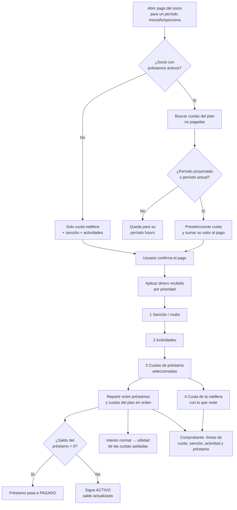

# Préstamos — Funcionalidades

Qué permite hacer el módulo de préstamos y, sobre todo, **cómo se relaciona con las cuotas de la natillera**. Descripción funcional: sin diseño, sin UI, sin detalle técnico de implementación.

- **Archivo:** [src/views/prestamos/Prestamos.vue](../../src/views/prestamos/Prestamos.vue)
- **Ruta:** `/natilleras/:id/prestamos`
- **Regla de activación:** el módulo solo opera si la natillera **permite préstamos** (`reglas_interes.activo !== false`). Si al crear la natillera se desactivaron los préstamos, el módulo queda bloqueado.

---

## 1. Qué es un préstamo en la natillera

Un préstamo es un desembolso de dinero **del fondo común de la natillera hacia un socio activo**, que este devuelve en cuotas periódicas con intereses. Los intereses que paga el socio son **utilidad de la natillera** (se reparten luego entre todos).

Cada préstamo tiene:

- **Socio beneficiario** (debe estar activo)
- **Capital prestado** (monto que se calcula sobre el fondo; mínimo **$10.000**)
- **Tasa de interés** (porcentaje mensual)
- **Tipo de interés:** `simple` o `compuesto`
- **Modalidad de cobro del interés:** `normal` o `anticipado`
- **Número de cuotas** (plazo) — limitado por el **plazo máximo** configurado en la natillera
- **Periodicidad:** `mensual` o `quincenal`
- **Medio de entrega:** `efectivo` o `transferencia`
- **Estado:** `activo` o `pagado`

Al crear el préstamo se genera automáticamente un **plan de pagos**: una lista de cuotas proyectadas (una por cada período), cada una con su fecha de vencimiento, valor, capital, interés y saldo restante. **Este plan de pagos es la pieza que conecta los préstamos con el módulo de Cuotas** (ver sección 6).

---

## 2. Configuración heredada de la natillera

El comportamiento de los préstamos se rige por reglas definidas **al crear/configurar la natillera** (`reglas_interes`):

| Regla | Significado | Default |
|-------|-------------|---------|
| `activo` | Si la natillera permite préstamos | `true` al crear con préstamos activos |
| `porcentaje` | Tasa de interés sugerida por defecto en el formulario | `2` (%) |
| `plazo_maximo` | Máximo de cuotas permitido por préstamo | `36` (o el elegido, p. ej. `6`) |

El formulario de nuevo préstamo arranca con estos valores por defecto, pero la tasa y el número de cuotas se pueden ajustar dentro de los límites permitidos.

---

## 3. Crear un préstamo

Permite otorgar un préstamo a un socio activo. El flujo captura socio, monto, tasa, tipo y modalidad de interés, número de cuotas, periodicidad, fecha de la primera cuota y medio de entrega.

### 3.1 Cálculo del interés

El interés **se calcula siempre igual** (simple o compuesto). Lo único que cambia entre "normal" y "anticipado" es **cuándo** el interés se reconoce como utilidad de la natillera.

- **Interés simple:** `Interés = Capital × tasa × nº cuotas`
- **Interés compuesto:** `Interés = Capital × (1 + tasa)^nº cuotas − Capital`
- En **periodicidad quincenal** la tasa mensual se divide entre 2 (cada quincena cobra media tasa mensual).

**Total a pagar por el socio = Capital + Interés total**, repartido en cuotas iguales.

### 3.2 Interés normal vs. anticipado

| | Interés **normal** | Interés **anticipado** |
|---|---|---|
| **Qué recibe el socio** | El capital completo | Capital **menos** el interés (el interés se retiene) |
| **Qué sale del fondo** | Solo el capital | Capital, pero el interés retenido queda en el fondo como utilidad |
| **Cuándo se registra la utilidad** | Progresivamente, **al pagar cada cuota** (interés proporcional de esa cuota) | **Todo el interés de una vez, al crear el préstamo** |
| **Cuota** | Capital + interés / nº cuotas | Igual (el interés ya distribuido) |

**Validación del anticipado:** el producto `tasa × nº cuotas` debe ser **menor al 100 %**; de lo contrario el descuento se comería todo el capital y el desembolso quedaría en cero. Se bloquea con aviso.

### 3.3 Validaciones al crear

1. **Monto mínimo:** $10.000.
2. **Plazo:** número de cuotas entre 1 y el `plazo_maximo` de la natillera.
3. **Interés anticipado válido** (`tasa × cuotas < 1`).
4. **Fondo suficiente:** se valida contra el **disponible del fondo según el medio de entrega**:
   - Si es **efectivo**, debe haber suficiente recaudado en efectivo.
   - Si es **transferencia**, suficiente recaudado por transferencia.
   - Lo que se compara es lo que **efectivamente sale del fondo**: capital completo (normal) o capital − interés retenido (anticipado).

### 3.4 Qué ocurre al confirmar

1. Se crea el préstamo en estado `activo` con su `saldo_actual` = capital + interés total.
2. Se **genera y guarda el plan de pagos** (una fila por cuota proyectada) con fechas, valores, capital/interés por cuota y saldo proyectado.
3. Si es **interés anticipado**, se registra **todo el interés** como utilidad clasificada de la natillera de inmediato.
4. Se registra la operación en auditoría.
5. Se muestra el **comprobante del préstamo** (descargable como imagen y compartible por WhatsApp), sin cerrar aún el modal.

> **Nota sobre el fondo:** el efecto del desembolso sobre el fondo se refleja a través del propio préstamo (se contabiliza como desembolsado en las estadísticas de la natillera según su medio de entrega), no como un movimiento manual de caja.

---

## 4. Plan de pagos (la estructura clave)

Cada préstamo genera un plan con **una cuota por período**:

- **Fecha proyectada de cada cuota:**
  - **Mensual:** el mismo día del mes de la fecha inicial; si el mes no tiene ese día (p. ej. 31 en febrero) se usa el último día del mes.
  - **Quincenal:** se suman 15 días por cada cuota.
- **Valor de la cuota:** total a pagar ÷ número de cuotas (cuotas iguales).
- **Capital e interés de cada cuota:** se desglosan (en interés normal, el interés se calcula sobre el saldo restante; en anticipado se distribuye equitativamente).
- **Saldo proyectado:** cuánto queda por pagar después de cada cuota.
- **Período (mes / año / quincena):** se deriva de la fecha proyectada. **Este período es lo que permite "casar" cada cuota del préstamo con el período de las cuotas de la natillera.**

Cada cuota del plan tiene su propio estado según lo abonado: **Pagada**, **Parcial**, **Vencida** (fecha pasada y sin pagar) o **Pendiente**.

---

## 5. Registrar abonos (desde el módulo de Préstamos)

Permite abonar directamente a un préstamo, indicando valor, fecha y forma de pago (efectivo/transferencia). Al registrar un abono:

1. Se reduce el `saldo_actual` del préstamo. Si llega a cero (o menos), el préstamo pasa a estado **`pagado`**.
2. El abono se **distribuye sobre las cuotas del plan** en orden (de la más antigua a la más nueva): cada cuota se marca pagada hasta agotar el abono; la última tocada puede quedar **parcial**.
3. Se **recalculan los saldos proyectados** de las cuotas que quedan pendientes.
4. Si el préstamo es de **interés normal**, el interés de las cuotas recién saldadas se **registra como utilidad** de la natillera (progresivo). Si es **anticipado**, no se registra nada extra (ya se cobró al inicio).
5. Se genera un **comprobante de abono** (descargable/compartible por WhatsApp), con saldo anterior y nuevo.

También se puede **editar** o **eliminar** un abono; el plan de pagos y los saldos se recalculan por completo de forma consistente.

---

## 6. Relación con las Cuotas de la natillera (integración central)

Esta es la parte más importante: **las cuotas de un préstamo se pueden cobrar junto con la cuota de la natillera del socio, dentro del módulo de Cuotas**, en el mismo acto de pago.

### 6.1 Cómo aparecen las cuotas del préstamo en el pago de la cuota natillera

Cuando en el módulo de **Cuotas** se abre el modal de pago de un socio para un período (mes/año/quincena):

1. El sistema busca los **préstamos activos** de ese socio.
2. De sus planes de pago, toma las cuotas **no pagadas**.
3. Determina cuáles están **programadas para ese período o períodos anteriores aún pendientes**, comparando el período proyectado de la cuota del préstamo con el período de la cuota de la natillera.
   - **Regla de acumulación:** una cuota de préstamo se considera "programada" si su período proyectado es **menor o igual** al de la cuota natillera. Así, las cuotas de préstamo de períodos pasados que quedaron pendientes **no desaparecen**: se acumulan y aparecen en la siguiente tarjeta del socio para poder cobrarse.
4. Esas cuotas se **preseleccionan** automáticamente y su valor se **suma al valor propuesto de pago** de la cuota natillera. El usuario puede deseleccionarlas.

### 6.2 Orden de aplicación del pago

Cuando el socio paga en el módulo de Cuotas, el dinero recibido se aplica en este **orden de prioridad**:

1. **Sanción / multa** (si la cuota tiene mora)
2. **Actividades** pendientes
3. **Cuotas de préstamo** seleccionadas
4. **Cuota de la natillera** (con lo que reste)

Es decir, los préstamos se cobran **antes** que la cuota de ahorro de la natillera pero **después** de sanciones y actividades. Si el pago no alcanza para todo, la cuota natillera queda parcial o pendiente y las cuotas de préstamo se cubren según lo reservado.

### Flujo del cobro conjunto (cuota natillera + préstamo)



> Si el pago no alcanza para cubrir todo, la prioridad se respeta de arriba hacia abajo: primero sanción y actividades, luego lo reservado a préstamos, y por último la cuota de ahorro de la natillera.

### 6.3 Qué pasa tras el pago

- El monto asignado a préstamos se **reparte proporcionalmente** entre los préstamos del socio (si tiene más de uno) y, dentro de cada uno, entre sus cuotas pendientes en orden.
- Se registran los abonos en el préstamo (con su forma de pago: efectivo/transferencia/mixto, para que el cuadre de caja cuadre) y se actualizan las cuotas del plan y el `saldo_actual`.
- El abono a préstamos entra en el **total recaudado** del mes y aparece como una **línea "préstamo"** en el comprobante de pago, junto a cuota, sanción y actividad.
- Si con ese pago el préstamo queda saldado, pasa a **`pagado`**.

### 6.4 Resumen visual en las tarjetas de Cuotas

En la vista de Cuotas agrupada por socio, cada tarjeta muestra, además de la cuota de ahorro:

- El **total pendiente de préstamos** que corresponde a ese período (incluyendo arrastres de períodos anteriores).
- Lo **ya abonado** a préstamos en ese período.

Esto permite ver, socio por socio, cuánto debe realmente en el mes contando ahorro + préstamo.

---

## 7. Refinanciar un préstamo

Permite reestructurar un préstamo activo que aún tiene saldo, sobre el **saldo actual** (no sobre el capital original):

- Se define **nueva fecha de inicio**, **nuevo número de cuotas**, **nueva tasa** y **tipo de interés** (o se conservan los originales).
- Se calcula el nuevo interés total sobre el saldo pendiente y se **regenera el plan de pagos** desde cero con las nuevas condiciones.
- El `saldo_actual` y el interés del préstamo se actualizan al nuevo total.
- Se conserva referencia al interés original para no doble-contar utilidades.

Como el plan de pagos se regenera con nuevas fechas/períodos, la integración con Cuotas (sección 6) sigue funcionando automáticamente con las nuevas cuotas.

---

## 8. Consultar el detalle de un préstamo

Permite abrir un préstamo y ver:

- Capital, tasa, tipo y modalidad de interés, periodicidad, número de cuotas.
- **Cuota mensual/quincenal** y **total a pagar**.
- **Saldo actual** y **cuotas restantes**.
- Estado **al día / en mora** (con número de cuotas vencidas) o **pagado**.
- **Plan de pagos completo** (cada cuota con su estado).
- **Historial de abonos** realizados (con su forma de pago y a qué cuotas se aplicaron).
- **Historial de refinanciaciones**, si las hubo.

---

## 9. Eliminar un préstamo

Permite borrar un préstamo (destructivo). Arrastra en cascada su **plan de pagos** y sus **abonos**. Requiere confirmación. Nota: al **eliminar un socio** también se eliminan en cascada todos sus préstamos, planes y pagos.

---

## 10. Totales del módulo

La vista muestra indicadores globales de la natillera:

- **Total prestado:** capital vigente prestado.
- **Total intereses ganados:** leído de las utilidades clasificadas (lo que el préstamo ha aportado como utilidad; anticipado al inicio, normal a medida que se pagan cuotas).
- **Total pagado / abonado.**

---

## 11. Comprobantes y WhatsApp

Se generan comprobantes como imagen (descargables y compartibles por WhatsApp) en tres momentos:

- **Al crear** un préstamo (resumen del préstamo y plan de pagos).
- **Al registrar un abono** (con saldo anterior/nuevo).
- **Reenvío** del comprobante de un abono ya realizado desde el historial.

El envío por WhatsApp usa el teléfono del socio; si no lo tiene, se solicita.

---

## 12. Estados del préstamo

```
activo  ──► pagado     (cuando el saldo llega a 0 por abonos, directos o desde Cuotas)
activo  ──► activo     (refinanciación: cambia condiciones, sigue activo)
activo  ──► eliminado  (borrado en cascada del plan y pagos)
```

Solo los préstamos **activos** aparecen para cobro en el módulo de Cuotas. Un préstamo **pagado** ya no genera cuotas pendientes ni se preselecciona en pagos.

---

## 13. Relación con otras entidades (resumen)

| Entidad | Relación con préstamos |
|---------|------------------------|
| `prestamos` | Registro principal del préstamo (capital, interés, estado, saldo). |
| `plan_pagos_prestamo` | Cuotas proyectadas del préstamo; **su período casa con las cuotas de la natillera**. |
| `pagos_prestamo` | Abonos, con su forma de pago y a qué cuotas se aplicaron. |
| **Cuotas de la natillera** | Las cuotas del préstamo se cobran junto a la cuota de ahorro del socio, con orden de prioridad definido (sección 6). |
| `utilidades_clasificadas` | Recibe el interés como utilidad: anticipado al inicio, normal al pagar cada cuota. |
| **Fondo / estadísticas** | El desembolso reduce el disponible del fondo según el medio de entrega; los abonos lo recomponen. |
| `socios_natillera` | El préstamo pertenece a un socio activo; al eliminarlo se borran sus préstamos en cascada. |
| `natilleras` (`reglas_interes`) | Define si hay préstamos, tasa por defecto y plazo máximo. |

---

## 14. Permisos

| Funcionalidad | Admin / Editor | Visor |
|---------------|:---:|:---:|
| Ver préstamos y detalle | ✅ | ✅ |
| Crear préstamo | ✅ | ❌ |
| Registrar / editar / eliminar abono | ✅ | ❌ |
| Refinanciar | ✅ | ❌ |
| Eliminar préstamo | ✅ | ❌ |
| Cobrar cuotas de préstamo desde Cuotas | ✅ | ❌ |

---

## 15. Casos especiales y comportamientos defensivos

| Caso | Qué hace el módulo |
|------|--------------------|
| Natillera con préstamos desactivados | El módulo queda bloqueado (`reglas_interes.activo === false`). |
| Monto < $10.000 | Bloquea con aviso de monto insuficiente. |
| Nº de cuotas fuera del plazo máximo | Bloquea e indica el máximo permitido. |
| Interés anticipado con `tasa × cuotas ≥ 100 %` | Bloquea: el descuento consumiría el capital. |
| Fondo insuficiente para el medio elegido | Bloquea indicando disponible vs. a desembolsar. |
| Cuotas de préstamo de meses pasados sin pagar | Se **acumulan** y reaparecen en la siguiente tarjeta del socio en Cuotas (no se pierden). |
| Pago insuficiente en Cuotas | Se respeta el orden: sanción → actividades → préstamo → cuota natillera. |
| Préstamo con interés anticipado | No se registra utilidad adicional al pagar cuotas (ya se cobró al inicio). |
| Socio sin teléfono | Se permite operar, pero se solicita teléfono al compartir comprobantes por WhatsApp. |
| Eliminar socio | Borra en cascada sus préstamos, planes y abonos. |
